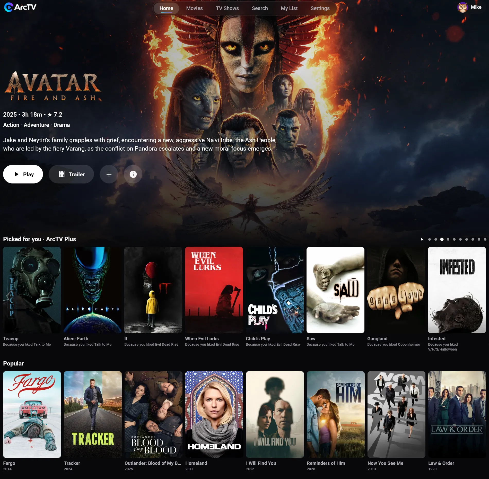

<h1 align="center">Arc TV on the web</h1>

<b>Your streaming, your way, in any browser.</b> 
A Netflix-style streaming app for Stremio-protocol addons, at <a href="https://web.arctv.org"><b>web.arctv.org</b></a>.

  <a href="https://web.arctv.org"><b>Open Arc TV on the web</b></a> ·
  <a href="https://arctv.org">arctv.org</a> ·
  <a href="docs/DEVELOPMENT.md">Developer guide</a>

  

Arc TV is a modern media center that puts everything you want to watch in one place. Content comes from **Stremio addons** rather than a fixed catalog, so you choose the addons you want, the same way Stremio itself works. Arc TV ships with no content of its own.

Use it in Chrome, Edge, Firefox or Safari on a computer, phone or tablet. There is nothing to install.

## ✨ What you get

- **One account everywhere**: sign in with the same email and password as the Arc TV apps and your My List, Continue Watching, addons, Home rows and settings are already there
- **Browse without signing up**: Home, Movies, TV Shows, Genres and Search work straight away; an account is only needed to play, save and sync
- **Addon-powered**: install any Stremio addon by its address and discover movies and shows from it
- **Pick your source**: a source list with quality badges, sizes and a recommended pick, and a player with quality, audio, subtitle and speed menus, skip, autoplay for the next episode and resume
- **Picked for you**: a Home row chosen from the movies and shows you like, finish and save, with the reason under every poster
- **Works with the mouse, keyboard, touch or arrow keys**
- **ArcTV Plus** (the optional paid tier; the free app stays free): up to 5 profiles with kids profiles and PIN locks, Picked for you, smart source picking, your watch stats, and a **Download** button on movies and episodes that is **only on the web for now** (coming soon: parental controls)

## 📱📺 Arc TV everywhere

Same account, same list, same addons on every device:

| | |
|---|---|
| 🌐 **Web** | [web.arctv.org](https://web.arctv.org) (this repository) |
| 📺 **Fire TV / Firestick / Android TV** | [ArcTV-AndroidTV](https://github.com/MikeC444/ArcTV-AndroidTV), also home of the account backend |
| 📱 **Android phones and tablets** | [ArcTV-MobileAPK](https://github.com/MikeC444/ArcTV-MobileAPK) |
| 💻 **Mac** | [ArcTV-Mac](https://github.com/MikeC444/ArcTV-Mac) |

## ❓ Questions

**Where do the movies and shows come from?** From the Stremio addons you add. Arc TV only plays what an addon provides and does not host or supply any content.

**Why does a source say "Can't play here"?** A browser is stricter than a TV: some formats (for example HEVC video or torrent-only sources) can't play in it. The source list says why on each row, and the same title usually has a source that works.

**Is it free?** Yes. Browsing, playing, My List, Continue Watching and addons are free. ArcTV Plus adds extras on top.

## 🛠️ For developers

The web app is a React + TypeScript single-page app with a small Node server that keeps your session private and talks to the same backend as the other Arc TV apps. Setup, configuration, tests, security notes and deployment are in the **[developer guide](docs/DEVELOPMENT.md)**.

Other docs: [`docs/AUDIT.md`](docs/AUDIT.md) (what was inspected and decided), [`docs/DEPLOYMENT.md`](docs/DEPLOYMENT.md), [`docs/PLAYBACK.md`](docs/PLAYBACK.md), [`docs/PROFILES.md`](docs/PROFILES.md).

Ideas, bug reports and pull requests are welcome: open an issue to say hi or to tell us what you'd love to see next.

*Arc TV was formerly called Arc TV.*
